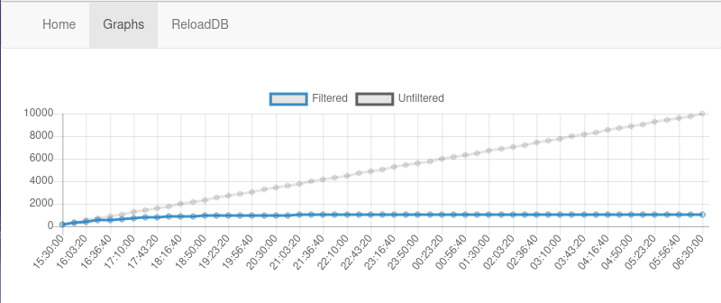

## DeDuplication with Redis Bloom

## Running Locally

Use docker-compose

```
docker-compose up
```

[Use the Web UI](http://localhost:5000)

[Redis Insight](http://localhost:8001)


## Using the Demo

[Navigate to the job submission page](http://localhost:5000)


- Set the number of messages to stream
- Set the percentage of duplicate messages
- Set the time to sleep between messages (stay over 5 ms)

The job will be submitted and the Graphs view will update every 10 seconds to show the Filtered (Deduplicated) message count and the Unfiltered(total) message count



## Presentation

The embedded presentation includes information based around deduplication use cases, how Bloom and Cuckoo filters work as well as more information about this demo.

[Embedded Preso](http://localhost:5000/preso)

## Developing Locally

### Starup docker container

```
docker run --rm -p 6379:6379 redis/redis-stack-server:latest
```


### Install python requirements

```
python3 -m venv venv
source venv/bin/activate
pip3 install -r requirements.txt
```

### Start the flask app

```
python3 app.py
```

### Navigate to the home page

1) [Webapp](http://localhost:5000)

2) Data will automatically load  if it is not already present

### Flow Diagram

