## De-Duplication

---

## Agenda

<small>

* Use Cases
* Why Redis?
* Why use a module?
* Bloom Filters
* Cuckoo Filters
* Demo

</small>

---

## Use Cases

- Messaging
- Update Limiting
- ETL Processing
- Ad Serving
- First Pass Filter

---

### Messaging
 
<small>

- Large online tools company in Fortune 50
- Sends updates and notifications to subscribers
- Customers unsubscribe when receiving duplicate updates
- Each message is a Bloom Filter with customer id as a member

</small>

---

### Update Limiting
 
<small>

- Set timed bucket with at TTL 
- Useful to combat alert fatigue
- Often around monitoring
- Critical_DBAlert_2020-01-06-1300

</small>

---

### ETL Processing
 
<small>

- asynchronous processing of logs or events
- Each duplicate costs more in processing and storage
- Usually large filters over time buckets

</small>

---

### Ad Serving
 
<small>

- Ad Networks often get paid for unique impressions
- Can be coupled with other modules to maximize revenue
- Main user focuses on Cuckoo filters
- [AdGears Demo](https://github.com/Redislabs-Solution-Architects/AdGears)

</small>

---

### First Pass Filter
 
<small>

- Used in fraud detection
- Filter out transactions <b>before</b> expensive AI calculations
- Bucket purchases by amounts for vendor AMAZON_100-199.99

</small>

 

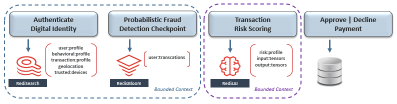

---

## Why Redis?
 
<small>

- centralized filter as opposed to several local ones
- inherits all of the HA, observability and automation of Redis
- Redis runs at ludicrous speed

</small>

---

## Why Modules? 
### Speed!

 

<small>

|Implementation|Add|Check|
|--|--|--|--|
|redablooms | 20k/s | 7k/s|
|lua | 29k/s | 25k/s|
|bloomd | 250k/s | 200k/s|
|redisbloom | 400k/s | 400k/s|
|  |  |  |

</small>

---

## Why Modules? 
### Efficiency!

 
<small>

| Benchmark | RedisBloom | Set |
|--|--|--|--|
|Size | 599,126 bytes | 18,000,005 bytes|
| 1M Checks | 1m23.81s | 1m26.85s |
|  |  | | |

</small>
 

---

## Bloom Filters

- Probabilistic data structure
- Trade accuracy for speed/efficiency
- Answer of "no" is 100% accurate
- Answer of "yes" has an error associated with it

---

## Cuckoo Filters

- Probabilistic data structure
- Trade accuracy for speed/efficiency
- Answer of "no" is 100% accurate
- Answer of "yes" has an error associated with it

---

# Wait a minute!!

---

### Hash Function
#### Building block of Probabalistic Data

<small>

- One way trap door
- Very fast
- Convert "Update to version 2.1.12 please" to "375"

</small>

---

### Hash Function

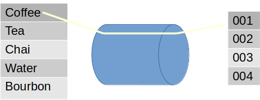

---

### Hash Function

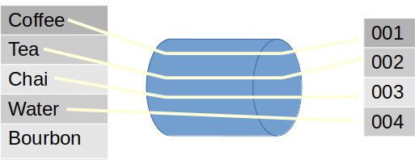

---

### Hash Function

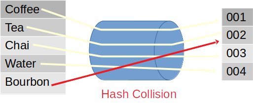

---

## Bloom Filter

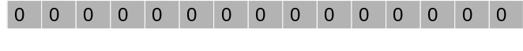

---

## Bloom Filter

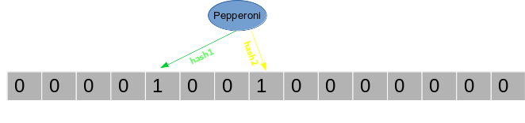

---

## Bloom Filter

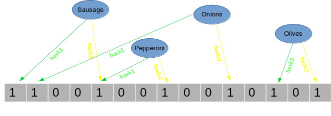

---

## Bloom Filter

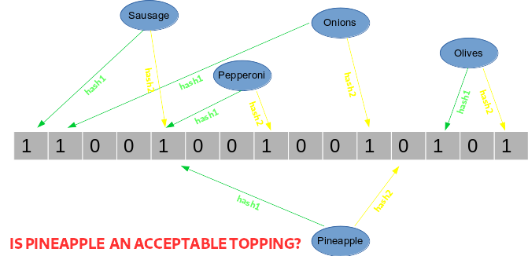

---

## Bloom Filter

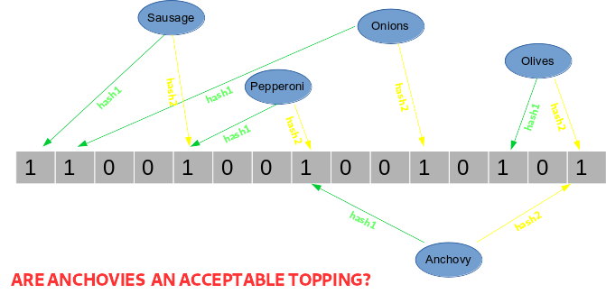

---

## Cuckoo Filter

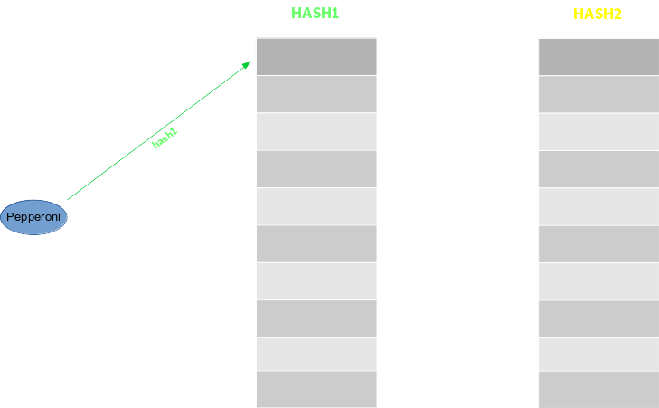

---

## Cuckoo Filter

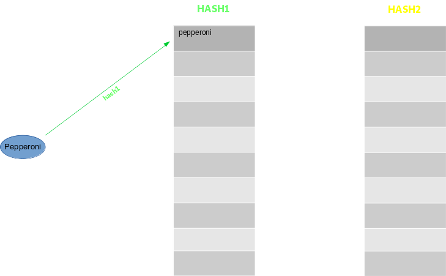

---

## Cuckoo Filter

---

## Cuckoo Filter

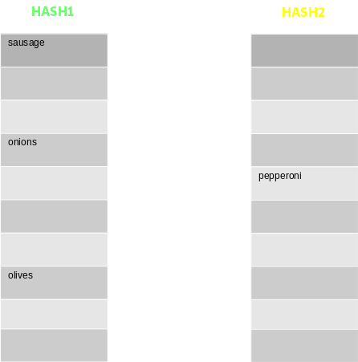

---

## Cuckoo Filter

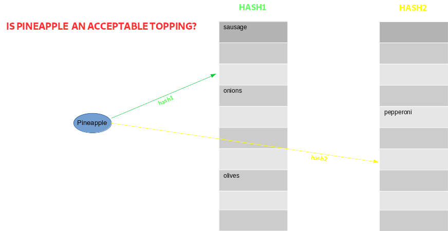

---

## Cuckoo Filter

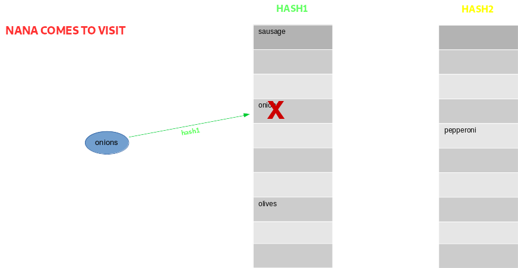

---

## When to Use

<small>

- Cuckoo Filter
    - Need to delete data from the filter
    - Faster Checks
    - CF.ADDNX is slower
- Bloom Filter
    - Insert is cheaper and faster
    - Smaller size
    - Insert/Check single operation
    - No deletions necessary

</small>

---

### Things Learned the Hard Way

<small>

- Size appropriately or pay the performance penalty
- Think carefully about how accurate you need to be
- Some client libraries are not what you would expect
- Be *absolutely positive* that all trade offs are communicated

</small>

---

### Other Capabilities

- Top-K
    - probabilistic leaderboard
    - May over count due to hash collisions
- Count-Min-Sketch
    - Frequency of events in a stream
    - May over count due to hash collisions

---

# Demo

---

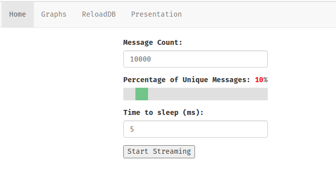

---

---

---

---

### The Gear

<pre><code>
def runIt(x):
    val = x['value']['Value']
    name = x['value']['Name']
    execute('TS.INCRBY', 's-unfiltered', 1, 'TIMESTAMP', '*')
    j = execute("BF.ADD", "DEDUP", val)
    if j > 0:
        execute('TS.INCRBY', 's-filtered', 1, 'TIMESTAMP', '*')

gb =  GearsBuilder(
        reader = 'StreamReader',
        desc   = "Process messages")

gb.map(runIt)
gb.register('MessageQueue')

</code></pre>

---

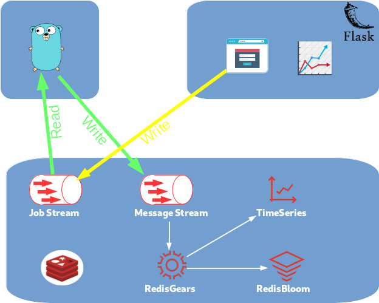

---

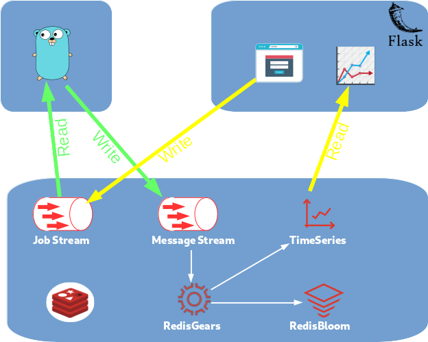

---

# Thanks
